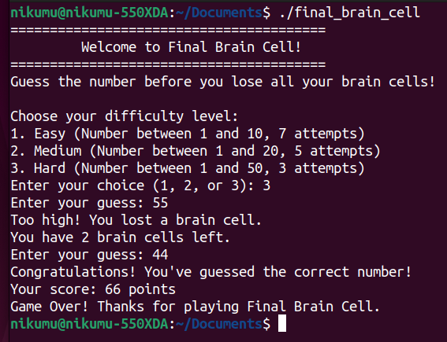

<p align="center">
  <a href="">
      
  </a>
</p>

# The Final Brain Cell 

Game based on a guessing system, where the player has a limited number of attempts to guess a random number. Each incorrect attempt 'eliminates' a brain cell, and the player loses when all brain cells are depleted.

## Explanation

### Difficulty levels

* The player can choose between three levels:

  * Easy: Number between 1 and 10, 7 attempts.
  * Medium: Number between 1 and 20, 5 attempts.
  * Hard: Number between 1 and 50, 3 attempts.
* The selected difficulty level defines the range of the number to guess and the number of available attempts.

### Scoring system

* The score is calculated based on the remaining attempts. The more brain cells (attempts) the player has left at the end, the higher the score.
* Formula: (remaining attempts * 50) / initial attempts.

With these changes, the game offers a greater challenge and encourages the player to maintain as many "brain cells" as possible to achieve a high score!

### To compile the C++ code
```
g++ the-final-brain-cell.cpp -o the-final-brain-cell
```
### To run the compiled program
```
./the-final-brain-cell
```
<br>

### Example


<p align="center">
  <a href="">
     
  </a>
</p>


